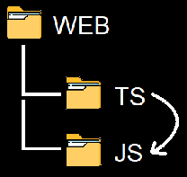

# SimplyTranspile
A basic simple Typed-JS to JS transpiler

Simply transpile will remove all the class annotations in your Typed-JS files in order to make them directly executable in you favorite browser.

### Why?

Having class annotations makes your code a De Facto TypeScript program. But it is not its purpose to fully support TypeScript. Rather, it is designed to allow inserting type annotations in your JavaScript code so you can take advantage of all the tooling available for TypeScript, such as:

- Code navigation
- Browsing references, definitions, declarations
- Error detections
- Code completion
- Parameter definitions

All this without having to surrender JavaScript readability once transferred in the browser (through transpiling or WebPack). This makes your code easier and faster to debug which is especialy great in a prototyping environment. (BTW, SimplyTranspile is NOT intented to be used in a productioon environment)

### How?

In VSCode, open a new Terminal Window.
Type : `node SimplyTranspile.js`

The program will then monitor a web/ts folder structure and will mirror (every 2 seconds) all updated `.TS` (and `.JS`) files into a web/js folder .

To terminate the program, simply `CTRL-C` the Terminal window.

Et Voilà!

### Want to contribute?

Pull requests are welcomed but keep in mind this is to be kept a small program... (Unuseful or changes introducing any dependencies will be kindly rejected!)
